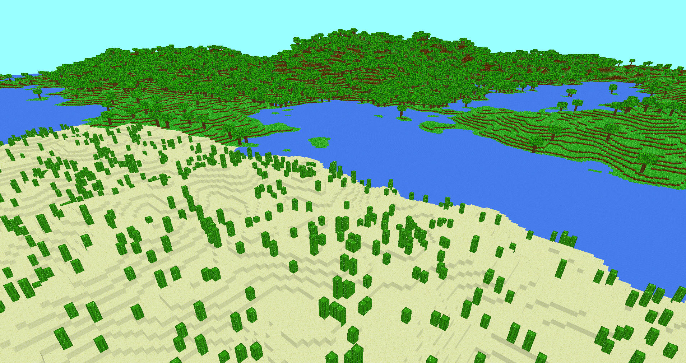

# MineCrap
A simple Minecraft clone written in C++<br>


## Building from source
Before building the project, ensure you have the following installed:
- C++ compiler with C++17 (or later) support
- CMake (version 3.10 or higher)

Clone the repository
```
git clone https://github.com/Fireroth/MineCrap.git
cd MineCrap
```

Run CMake
```
cmake ./
```

Build the project
```
cmake --build .
```

## ✨ Features
-  Face Culling
-  Chunk based world generation
-  Block placing and breaking
-  Infinite terrain
-  Biomes

## 🛠️ To-Do
-  Inventory system
-  Sounds
-  Frustum culling
-  Transparent blocks
-  Player physics & collisions
-  Chunk saving

## 📚 Libraries used
- [glfw](https://www.glfw.org/) – Window and input handling  
- [glad](https://github.com/Dav1dde/glad) – GL Loader-Generator
- [glm](https://github.com/g-truc/glm) – OpenGL math library
- [stb_image](https://github.com/nothings/stb) – Image loading  
- [ImGUI](https://github.com/ocornut/imgui) – GUI system
- [FastNoiseLite](https://github.com/Auburn/FastNoiseLite) – Noise generator (for terrain)

---

🙌 Honorable Mentions<br>
<sub>jdh - [YouTube](https://www.youtube.com/@jdh)<br> 
Low Level Game Dev - [YouTube](https://www.youtube.com/@lowlevelgamedev9330)<br> 
WSAL Evan - [YouTube](https://www.youtube.com/@wsalevan)<br> 
obiwac - [YouTube](https://www.youtube.com/@obiwac)<br> 
LearnOpenGL - [Website](https://learnopengl.com/)</sub>
